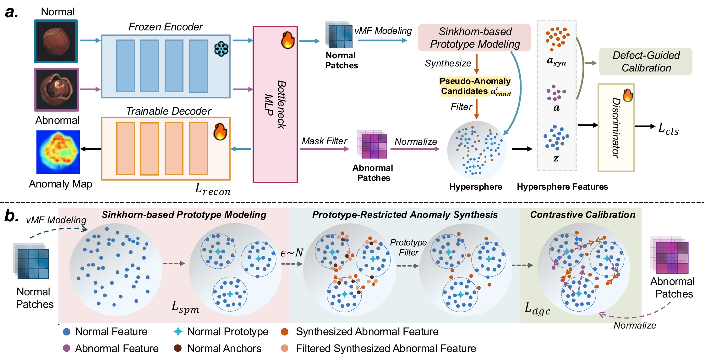

<div align="center">

# ArcAD: Anomaly-Rectified Calibration for Cold-Start Supervised Anomaly Detection

[](https://arxiv.org/pdf/2607.02252)
[](https://eccv.ecva/)
[](#license)

**A plug-and-play calibration framework for reconstruction-based Industrial Anomaly Detection under cold-start conditions.**

🎉 **Accepted to ECCV 2026.**
</div>

## 🔔 News
- **2026-07**: Code and **data-split JSONs** for MVTec-AD / VisA / Real-IAD / MANTA are released.
- ArcAD is accepted to **ECCV 2026**.

## 📖 Introduction

Deploying Industrial Anomaly Detection (IAD) in real manufacturing frequently hits a **cold-start bottleneck**: very few normal samples are available to represent the full normal distribution, and only a handful of anomalies are at hand. Under this regime, existing methods struggle to form a compact normal boundary and fail to exploit the rare supervised defect signal.

**ArcAD** (Anomaly-Rectified Cold-start AD) is a plug-and-play calibration framework built on top of reconstruction-based IAD baselines. Under data scarcity, it constructs a compact and discriminative normal boundary by combining hypersphere-based prototype modeling (**SPM**) with defect-guided contrastive calibration (**DGC**).

Extensive experiments on **MVTec-AD, VisA, Real-IAD, and MANTA** show that ArcAD clearly outperforms state-of-the-art supervised and unsupervised methods in both single-class and multi-class settings under cold-start conditions.

<div align="center">

<br>
<em>Figure 1: Overall framework of ArcAD.</em>
</div>

## 📊 Results

Multi-class unified cold-start setting (all categories trained in a single model).
Each cell reports **I-AUROC / P-AUROC / P-F1-max (%)** (Table 1 of the paper).

| Method | MVTec-AD | VisA | Real-IAD | MANTA |
|--------|----------|------|----------|-------|
| **ArcAD** | 99.7 / 99.2 / 68.9 | 98.9 / 99.0 / 54.9 | 92.5 / 99.0 / 49.8 | 93.3 / 95.5 / 48.5 |

> ArcAD is built upon Dinomaly as the reconstruction baseline. Per-category results are written to `saved_results/<save_name>/results.csv` after evaluation.

## 🛠️ Environment

```bash
conda create -n arcad python=3.8
conda activate arcad
pip install -r requirements.txt
```

Tested on a single NVIDIA RTX 3090 (24GB) with PyTorch 1.12 + CUDA 11.3. Key dependencies: `torch`, `torchvision`, `timm`, `scikit-learn`, `opencv-python-headless`, `tabulate`.

The frozen DINOv2-reg ViT-B/14 backbone weights should be placed at:
```
backbones/weights/dinov2_vitb14_reg4_pretrain.pth
```
(Download from the official DINOv2 release; the registers variant.)

## 📁 Data Preparation

ArcAD adopts a **cold-start supervised** split: a small `labeled` set (few normals + few anomalies, with masks) for training, and a `test` set for evaluation. The exact splits we used are released as open JSON files on 🤗 Hugging Face:

> **Dataset splits:** <https://huggingface.co/datasets/nnh1012/ArcAD_Cold-start_Data_Splits>

Each split JSON is a *manifest* — a list of which images (and their masks) belong to the `labeled` / `test` sets. **All paths are written against the original download structure of each dataset** — just download the official datasets, set `--data_path` to the root, and the relative paths resolve directly, with no reorganization needed. The manifests do **not** contain the images themselves.

### Split JSON format

Every `<category>.json` has the same schema:

```json
{
  "meta":   { "dataset": "mvtec", "category": "bottle", "num_labeled": 69, "num_test": 223 },
  "labeled":[ { "image": "bottle/train/good/000.png",            "mask": "",                                              "label": 0, "anomaly_class": "good" },
              { "image": "bottle/test/broken_large/005.png",     "mask": "bottle/ground_truth/broken_large/005_mask.png", "label": 1, "anomaly_class": "broken_large" } ],
  "test":   [ ... ]
}
```

- All paths are **relative to the dataset root** (the `--data_path` argument) and use each dataset's **original download layout**.
- `mask` is `""` for normal samples (no mask file).
- `label`: `0` = normal, `1` = anomaly.
- `anomaly_class`: `"good"` for normals; the defect sub-folder name (e.g. `broken_large`) for MVTec, `"anomaly"` for VisA / Real-IAD / MANTA.

The total number of labeled samples matches the cold-start protocol (e.g. MVTec-AD: 1089 normals + 121 anomalies; Real-IAD: 10940 normals + 1216 anomalies).

### Expected on-disk layout

The JSON paths resolve against the **official download structure** of each dataset. Point `--data_path` at the root shown below:

<details>
<summary><b>MVTec-AD</b></summary>

```
<data_path>/bottle/
    train/good/*.png
    test/good/*.png
    test/<defect_type>/*.png            # e.g. broken_large, broken_small, contamination, ...
    ground_truth/<defect_type>/<name>_mask.png
```
</details>

<details>
<summary><b>VisA</b></summary>

```
<data_path>/candle/
    Data/Images/Normal/*.JPG
    Data/Images/Anomaly/*.JPG
    Data/Masks/Anomaly/*.png
```
</details>

<details>
<summary><b>Real-IAD</b></summary>

```
<data_path>/realiad_1024/<category>/<image>      # image_path from realiad_jsons/sup/<cat>.json
<data_path>/realiad_jsons/sup/<category>.json    # authoritative labeled/test split
```
</details>

<details>
<summary><b>MANTA</b></summary>

```
<data_path>/MANTA_TINY_256_cropped/<category>/<image>
<data_path>/sup_cropped/<category>.json          # authoritative labeled/test split
```
</details>

## 🚀 Usage

Training and evaluation run in the same script (the model is evaluated on the test set every `eval_freq` iterations and at the end). Each dataset has its own entry-point script.

### Step 1 — Generate prototypes (once per dataset)

Prototypes are K-means centers of the normal-sample bottleneck features, used to initialize SPM. A single generator handles all datasets via `--dataset`:

```bash
python gen_protos.py --dataset mvtec
python gen_protos.py --dataset visa
python gen_protos.py --dataset manta
python gen_protos.py --dataset realiad
```

This writes `prototypes_init.pth` into the dataset's init directory. The number of prototypes `K` defaults to **500** (override with `--num_prototypes N`). Set the GPU with `GEN_DEV=cuda:N` if needed.

> **Single-class setting:** pass `--separate_classes` to emit one prototype file per category (`prototypes_init_<category>.pth`) instead of a single global file.

### Step 2 — Train + evaluate

```bash
# MVTec-AD
python arcad_mvtec_uni.py \
    --data_path /path/to/mvtec_CD \
    --save_name arcad_mvtec

# VisA
python arcad_visa_uni.py \
    --data_path /path/to/VisA_CD \
    --save_name arcad_visa

# Real-IAD
python arcad_realiad_uni.py \
    --data_path /path/to/Real-IAD_CD \
    --save_name arcad_realiad

# MANTA
python arcad_manta_uni.py \
    --data_path /path/to/MANTA_CD \
    --save_name arcad_manta
```

Each script points to the prototype file generated in Step 1 by default; override the path with `--proto_path` if you placed it elsewhere.

Results, checkpoints, and logs are saved under `saved_results/<save_name>/`:
- `results.csv` — per-category + `Mean` metrics
- `model.pth` — final weights
- `log.txt` — training log

## 📂 Repository Structure

```
ArcAD/
├── arcad_{mvtec,visa,manta,realiad}_uni.py   # per-dataset train+eval entry points
├── gen_protos.py                              # unified prototype generator (--dataset)
├── dataset.py                                 # dataset classes (cold-start splits)
├── models/                                    # ViTill reconstruction backbone, SPM, DGC
├── backbones/                                 # frozen DINOv2 encoder loader
├── optimizers/                                # StableAdamW, cosine scheduler
├── utils.py                                   # metrics, logging
└── requirements.txt
```

## 🙏 Acknowledgements

This implementation is built upon [Dinomaly](https://github.com/guojiajeremy/dinomaly) (CVPR 2025), whose minimal reconstruction framework and DINOv2 integration we reuse. We thank the Dinomaly authors. We also thank the maintainers of MVTec-AD, VisA, Real-IAD, and MANTA.

## 📜 Citation

If you find this work useful, please cite:

```bibtex
@article{han2026arcad,
  title   = {ArcAD: Anomaly-Rectified Calibration for Cold-Start Supervised Anomaly Detection},
  author  = {Han, Ningning and Fan, Lei and Guo, Jia and Cao, Yunkang and Su, Xiu and Cao, Feng and Di, Donglin and Su, Tonghua},
  journal = {arXiv preprint arXiv:2607.02252},
  year    = {2026}
}
```

Paper: <https://arxiv.org/pdf/2607.02252>

## License

This project is released under the MIT License.
